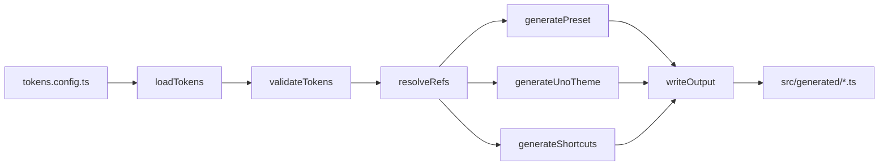

# Architecture

## Monorepo layout

```
packages/
  core/        # The published `@jfitzsimmons2/theme-unify` package — CLI, generators, public API
  playground/  # @theme-unify/playground — Vue 3 + PrimeVue + UnoCSS demo app
```

The root [package.json](../package.json) is private and only exists to host
workspace-wide scripts.

## Big picture

PrimeVue 4's `definePreset(Aura, ...)` is the **runtime source of truth**.
At boot it emits a CSS variable for every token (`--p-primary-500`,
`--p-spacing-md`, `--p-border-radius-sm`, …). theme-unify's job is to
generate two artifacts from one config:

1. A PrimeVue preset (extends Aura with your tokens + overrides).
2. An UnoCSS theme whose values are `var(--p-*)` strings pointing at the
   variables (1) emits.

Result: utility classes (`bg-primary-500`, `p-md`, `rounded-sm`) and
PrimeVue components both resolve to the same variables. Swap the preset
at runtime and the utilities follow without rebuilding.

## High-level data flow



See [pipeline.md](pipeline.md) for per-stage details.

## Core modules

All paths are under [packages/core/src](../packages/core/src).

| File | Responsibility |
| --- | --- |
| [index.ts](../packages/core/src/index.ts) | Public API surface — every export is part of the package contract |
| [define-tokens.ts](../packages/core/src/define-tokens.ts) | `defineTokens()` identity helper for type inference |
| [typed.ts](../packages/core/src/typed.ts) | Generic `defineTypedTokens<Preset>()` helper + `DeepTokenValue<T>` / `TypedThemeUnifyConfig<Preset>` types (entry: `@jfitzsimmons2/theme-unify/typed`) |
| typed-{aura,lara,nora,material}.ts | Per-base sugar entries re-exporting `defineTokens` pre-bound to the matching PrimeUix preset (entries: `@jfitzsimmons2/theme-unify/aura`, `/lara`, `/nora`, `/material`) |
| [load-tokens.ts](../packages/core/src/load-tokens.ts) | Resolve and dynamically import a config file via `jiti` |
| [validator.ts](../packages/core/src/validator.ts) | Schema/value/ref validation; throws `TokenValidationError` |
| [resolver.ts](../packages/core/src/resolver.ts) | Replace `{ ref: "…" }` inside `preset.overrides`, with cycle detection |
| [types.ts](../packages/core/src/types.ts) | All public + internal token types |
| [builtin-palettes.ts](../packages/core/src/builtin-palettes.ts) | 22 Tailwind/PrimeUix color scales + `resolveScale` lookup with builtin fallback |
| [errors.ts](../packages/core/src/errors.ts) | `CircularReferenceError`, `UnresolvedRefError`, `TokenValidationError` |
| [write-output.ts](../packages/core/src/write-output.ts) | Idempotent file writer (skip if unchanged) |
| [cli.ts](../packages/core/src/cli.ts) | `cac`-based CLI entry; bin: `@jfitzsimmons2/theme-unify` |
| [vite.ts](../packages/core/src/vite.ts) | Placeholder Vite plugin |
| [generators/](../packages/core/src/generators) | One file per output format — see [generators.md](generators.md) |

## Public API contract

Anything re-exported from
[packages/core/src/index.ts](../packages/core/src/index.ts) is part of
the public API and follows the stability rules in
[contributing.md](contributing.md). Currently:

- Functions: `defineTokens`, `loadTokens`, `resolveRefs`,
  `validateTokens`, `generatePreset`, `buildPresetObject`,
  `resolveSemanticScale`, `generateUnoTheme`, `generateShortcuts`,
  `isBuiltinPalette`, `resolveScale`, `isRef`
- Types: `ThemeUnifyConfig`, `ResolvedThemeUnifyConfig`, the various
  config sub-types, `BuiltinPaletteName`, `CanonicalSemanticRole`
- Constants: `COLOR_STEPS`, `PRIMEVUE_BASE_THEMES`,
  `CANONICAL_SEMANTIC_ROLES`, `BUILTIN_PALETTES`, `BUILTIN_PALETTE_NAMES`

### Generator role canonicalization

The PrimeVue and UnoCSS generators both **canonicalize**
`semantic.extra` keys before emitting them: legacy aliases `warning`
and `error` are rewritten to PrimeVue's official severity names
`warn` and `danger`. Custom roles (e.g. `accent`) pass through
unchanged. The validator emits a deprecation warning for the legacy
aliases and an info-severity issue for non-canonical names — see
[token-schema.md → Canonical semantic roles](token-schema.md#canonical-semantic-roles).

## Build output

[tsup.config.ts](../packages/core/tsup.config.ts) builds eight entries
(`index`, `cli`, `vite`, `typed`, `typed-aura`, `typed-lara`,
`typed-nora`, `typed-material`) in both ESM and CJS, with `.d.ts`
files. Only
the `dist/` folder ships — see [release.md](release.md).

## Dark-mode pipeline

`meta.darkModeStrategy` (`"class"` | `"media"`, default `"class"`)
controls how dark mode propagates through every generated artifact:

1. **PrimeVue preset** (`preset.ts`) — the generated `themeOptions`
   object sets `darkModeSelector` to either the user's CSS selector
   (class strategy) or `".system"` (PrimeVue's sentinel for
   `prefers-color-scheme`, media strategy). Consumers spread this into
   `app.use(PrimeVue, { theme: { options: themeOptions } })`.

2. **UnoCSS theme** (`uno-theme.ts`) — exports a `darkMode` constant
   (`"class"` or `"media"`). The playground's `uno.config.ts` feeds it
   into `presetUno({ dark: darkMode })` so the `dark:` variant
   activates via the same mechanism.

3. **UnoCSS shortcuts** (`shortcuts.ts`) — shortcut strings always
   contain `dark:` prefixes. UnoCSS interprets them per the `darkMode`
   constant above; no code change is needed in the shortcut generator.

4. **Validator** — rejects unknown strategy values, warns when
   `darkModeSelector` is set under the media strategy (it is ignored).
