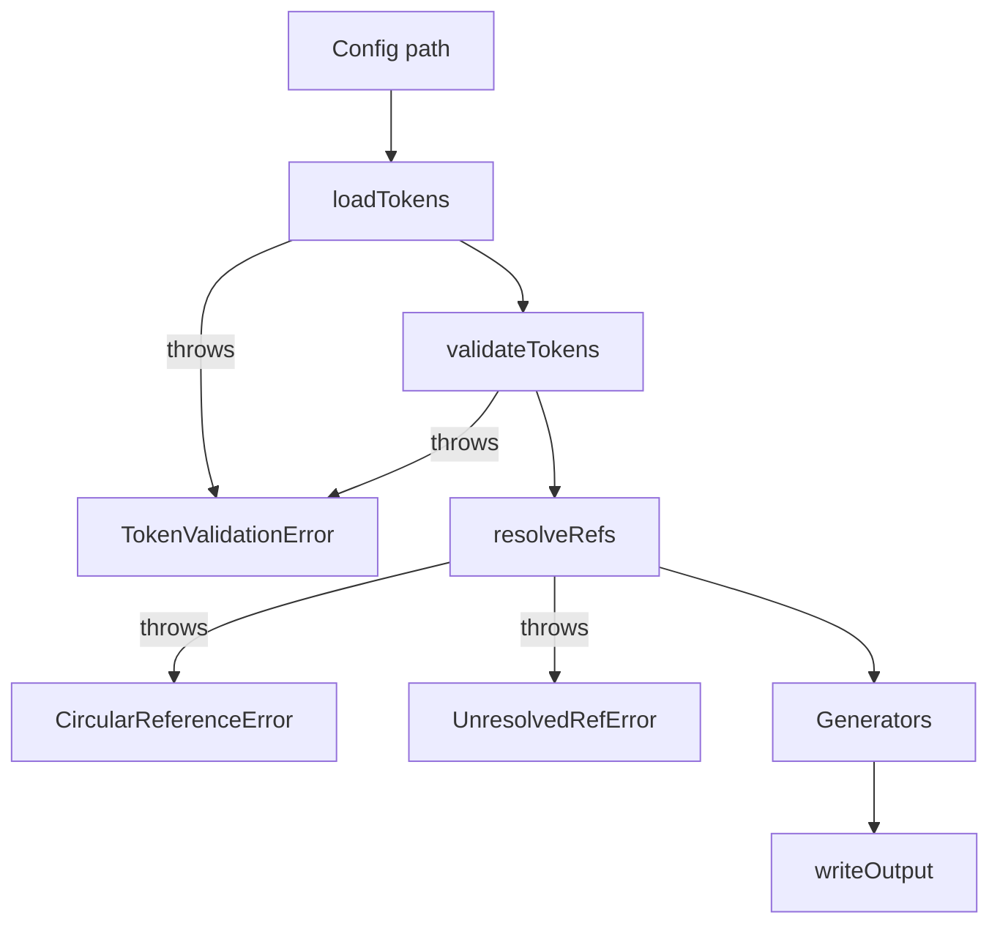

# Processing pipeline



Every stage is a pure function over plain data; the CLI
([packages/core/src/cli.ts](../packages/core/src/cli.ts)) is the only
thing that performs IO outside of `loadTokens` and `writeOutput`.

## 1. `loadTokens(configPath)`

Source: [load-tokens.ts](../packages/core/src/load-tokens.ts).

- Resolves the path against `process.cwd()`.
- Uses `jiti` to dynamically import the TS config file (no Node loader
  hooks, no pre-compilation step).
- Reads the `default` export.
- Calls `validateTokens` before returning.

The CLI passes the raw `--config` value through `path.resolve`.

## 2. `validateTokens(tokens)`

Source: [validator.ts](../packages/core/src/validator.ts).

Collects all issues into a `ValidationIssue[]`, then throws a single
`TokenValidationError` if non-empty. Checks include:

- All color scales have all 11 `ColorStep` keys.
- `primevue.base` (if present) is in `PRIMEVUE_BASE_THEMES`.
- All ref paths resolve (delegates to `resolveRefs` internally for the dry
  run).
- CSS-value-shaped strings (e.g. `radii`) are non-empty strings.

## 3. `resolveRefs(tokens)`

Source: [resolver.ts](../packages/core/src/resolver.ts).

- Walks the entire object tree.
- For each `Ref`, expands the alias prefix (see
  [token-schema.md](token-schema.md#path-aliases)) and looks up the target.
- Tracks the resolution chain to detect cycles → `CircularReferenceError`
  with the offending `cycle: string[]`.
- Missing target → `UnresolvedRefError` with the `refPath` and `location`
  in the source object.

Returns `ResolvedTokens` / `ResolvedAutoTokens` where every `TokenValue` is
a `string`.

## 4. Generators

Each generator is a pure `(resolved) => string` function plus an optional
runtime builder `(resolved) => object`. See
[generators.md](generators.md).

The CLI calls all generators in sequence:

```ts
const primevueCode = generatePrimeVue(resolved);
const unoCSSCode   = generateUnoCSS(resolved);
const shortcutsCode = generateShortcuts(resolved);
const ptCode       = generatePrimeVuePT(resolved);
const baseCssCode  = generatePrimeVueBaseCss(resolved); // null when no
                                                         // typography base
```

The PrimeVue generator emits two artifacts: the preset object
(`primevue-preset.ts`) and an optional CSS preflight
(`primevue-base.css`) carrying `font-size` / `line-height` / `font-family`
declarations. The CSS file is only written when at least one of
`primitive.typography.baseFontSize` / `baseLineHeight` is set.

## 5. `writeOutput(outDir, filename, content)`

Source: [write-output.ts](../packages/core/src/write-output.ts).

- `mkdirSync(outDir, { recursive: true })`.
- If the file exists and content is byte-identical → returns `false`
  (skipped). This prevents spurious HMR triggers in the playground.
- Otherwise writes and returns `true`.

The CLI prints `✓ name` for written files and `· name (unchanged)` for
skipped ones.

## Error classes

Defined in [errors.ts](../packages/core/src/errors.ts):

| Class | When thrown | Notable fields |
| --- | --- | --- |
| `TokenValidationError` | Any validation failure | `errors: ValidationIssue[]` |
| `CircularReferenceError` | Ref cycle detected during resolution | `cycle: string[]` |
| `UnresolvedRefError` | Ref points at a non-existent path | `refPath`, `location` |

The CLI catches `TokenValidationError` and exits 1 with the formatted
message; any other error logs `Error: <message>` and also exits 1.
