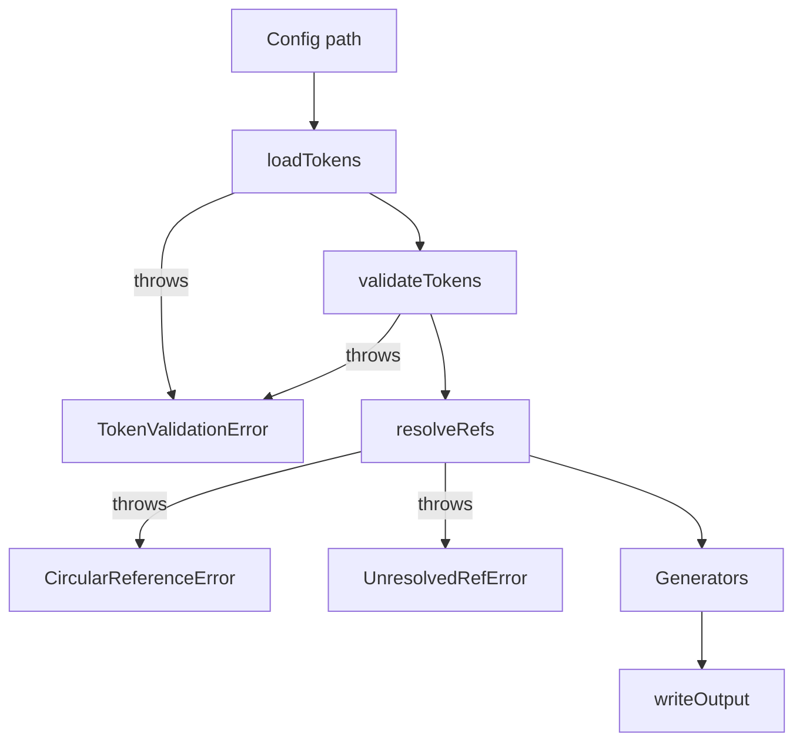

# Processing pipeline



Every stage is a pure function over plain data; the CLI
([packages/core/src/cli.ts](../packages/core/src/cli.ts)) is the only
thing that performs IO outside of `loadTokens` and `writeOutput`.

## 1. `loadTokens(configPath)`

Source: [load-tokens.ts](../packages/core/src/load-tokens.ts).

- Resolves the path against `process.cwd()`.
- Uses `jiti` to dynamically import the TS config file (no Node loader
  hooks, no pre-compilation step).
- Reads the `default` export and asserts it is a `ThemeUnifyConfig`.
- Calls `validateTokens` before returning.

## 2. `validateTokens(tokens)`

Source: [validator.ts](../packages/core/src/validator.ts).

Collects all issues into a `ValidationIssue[]`, then throws a single
`TokenValidationError` if non-empty. Checks include:

- All color scales in `primitive.colors` have all 11 `ColorStep` keys.
- Every inline `ColorScale` in `semantic` is fully populated.
- Every `SemanticScaleRef` string names either a key in
  `primitive.colors` or a builtin palette.
- `preset.base` (if present) is in `PRIMEVUE_BASE_THEMES`.
- All ref paths inside `preset.overrides` resolve.

## 3. `resolveRefs(tokens)`

Source: [resolver.ts](../packages/core/src/resolver.ts).

- Walks `preset.overrides` only — `primitive` and `semantic` do not use
  `{ ref }` objects.
- For each `Ref`, expands the alias prefix (see
  [token-schema.md](token-schema.md#refs)) and looks up the target.
- Tracks the resolution chain to detect cycles → `CircularReferenceError`.
- Missing target → `UnresolvedRefError`.

Returns `ResolvedThemeUnifyConfig` where every value inside
`preset.overrides` is a string.

## 4. Generators

The CLI calls all three in sequence:

```ts
const presetCode    = generatePreset(resolved);
const unoThemeCode  = generateUnoTheme(resolved);
const shortcutsCode = generateShortcuts(resolved);
```

See [generators.md](generators.md) for what each one emits.

## 5. `writeOutput(outDir, filename, content)`

Source: [write-output.ts](../packages/core/src/write-output.ts).

- `mkdirSync(outDir, { recursive: true })`.
- If the file exists and content is byte-identical → returns `false`
  (skipped). This prevents spurious HMR triggers in the playground.
- Otherwise writes and returns `true`.

The CLI prints `✓ name` for written files and `· name (unchanged)` for
skipped ones. `--force` writes regardless.

## Error classes

Defined in [errors.ts](../packages/core/src/errors.ts):

| Class | When thrown | Notable fields |
| --- | --- | --- |
| `TokenValidationError` | Any validation failure | `errors: ValidationIssue[]` |
| `CircularReferenceError` | Ref cycle detected during resolution | `cycle: string[]` |
| `UnresolvedRefError` | Ref points at a non-existent path | `refPath`, `location` |

The CLI catches `TokenValidationError` and exits 1 with the formatted
message; any other error logs `Error: <message>` and also exits 1.
